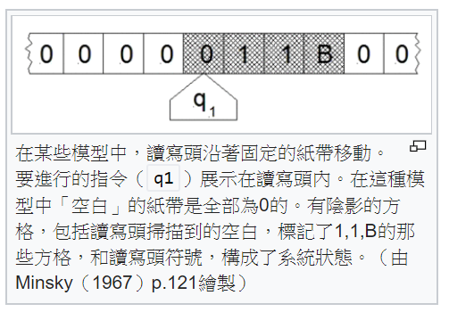

# 計算機的複雜度階層

演算法 (或說程式) 的複雜度通常以 Big O 表示，像是 $`O(log n) , O(n^2), O(2^n)`$ 等等。

在計算理論領域，雖然複雜度仍然是用 BigO 的概念，但是為了更清楚地描述問題，必須考慮《程式所執行的電腦架構》。

可惜現代電腦的數學模型會太過複雜，難以精確描述，於是我們還是經常會使用《電腦發展初期》的《硬體架構》。

其中一個最常被使用的《理論架構》就是《圖靈機》 (Turing Machine) 。

## 圖靈機 Turing Machine

圖靈機是一台具有《無限長磁帶》的電腦，其示意圖如下：



更詳細的圖靈機描述請參考：

* [維基百科: 圖靈機](https://zh.wikipedia.org/wiki/%E5%9B%BE%E7%81%B5%E6%9C%BA)

接下來我們要討論主題是 NP (Non-deterministic polynomial) ，為了要理解 NP 概念，我們必須引入《非確定性圖靈機》。

## 非確定性圖靈機 (Non-deterministic Turing Machine)

《非確定性圖靈機》是一種可以把《所有可能的路徑同時探索走過》的《圖靈機》，換句話就是一種可以《無限高度平行化》的圖靈機。

或者我們可以引入一個概念稱為《神諭》(Oracle) ，這個概念代表《程式永遠會在多種不同的路徑當中選擇正確可以達到目標的那一條》，具有這樣特性的機器我們稱為《神諭機》或《預言機》。

* [維基百科: 預言機](https://zh.wikipedia.org/wiki/%E9%A0%90%E8%A8%80%E6%A9%9F)

## NP (Non-deterministic polynomial 非確定性多項式時間)

如果我們用《預言機》來寫程式解決某些問題，那些可以在多項式時間內，例如 O(n log n) , O(n^2), O(n^10) 時間內執行完畢的程式，就稱為《預言機多項式》程式，而那些可以在《多項式時間內用預言機解決的問題》，就稱為《非確定性多項式問題》 (Non-deterministic Polynomial Problem)，簡稱 NP 問題。

用《預言機》來衡量的複雜度，就稱為 《非確定性複雜度》，NP 就是指《非確定性複雜度衡量後可以在多項式時間內完成》的意思！


[維基百科-NP 複雜度]:https://zh.wikipedia.org/wiki/NP_(%E8%A4%87%E9%9B%9C%E5%BA%A6)

* [維基百科-NP 複雜度]

簡單來說，NP 問題是指《多項式時間內用預言機解決的問題》，我們也可以改用《在多項式時間內可以被驗證其正確性的問題》的想法來思考此一問題。

而 NP-hard 問題則是指《比 NP 更難》的問題。

但是《比 NP 更難》並不是指那些《無法用預言機在多項式時間內完成的問題》。

NP-hard 是指所有的 NP 問題都可以被轉化為某 NP-hard 問題，然後得到解決的那種問題，請參考：

* [維基百科: NP 困難](https://zh.wikipedia.org/wiki/NP%E5%9B%B0%E9%9A%BE)

Stephen Cook 在 1971 年證明了一件事： SAT 問題是一個 NP-hard 問題，意思就是所有的 NP 問題都可以轉化為 SAT 問題。

> Cook, Stephen (1971). ["The complexity of theorem proving procedures"](http://portal.acm.org/citation.cfm?coll=GUIDE&dl=GUIDE&id=805047). Proceedings of the Third Annual ACM Symposium on Theory of Computing. pp. 151–158. doi:10.1145/800157.805047.

因此 SAT 問題被稱為 NP-Complete 問題 (NP-完備問題) ，也就是 NP 問題裏最難的一類問題。

Stephen Cook 的論文證明了後來被稱為 Cook–Levin theorem 的定理，提出了一類稱為 NP-Complete 的問題，後來 Leonid Levin 找到幾十個這類的 NP-Complete 問題，因此該定理被稱為 Cook–Levin theorem 。

Cook 的證明就是利用將『非確定圖靈機』的執行轉化為 SAT 問題，進而把所有『非確定圖靈機』在多項式時間內可解的問題，通通在多項式時間內轉化成 SAT 問題的方法，證明了所有 NP 問題都可以 reduce 成 SAT 問題。

要進一步了解該證明請參考

* [Wikipedia: Cook–Levin theorem](https://en.wikipedia.org/wiki/Cook%E2%80%93Levin_theorem)

在此我們簡單用圖表解說如何將《非確定圖靈機》程式轉化為 SAT 邏輯式的方法。

非確定圖靈機可用 M = (Q, Σ, s, F, δ) 表示，其符號意義如下：

```
Q: 機器狀態集合
Σ: 磁帶符號集合
s: 初始狀態
F: 結束狀態集合
δ: 狀態轉移函數
```

變數      | 邏輯意義                      | 轉換時間
----------|------------------------------|--------------------------------------------
$`T_{i,j,k}`$  | 磁帶第 i 格在 k 時間包含符號 k | $`O(p(n)^2)`$
$`H_{i,k}`$    | 讀寫頭在時間 k 時位於第 i 格上 | $`O(p(n)^2)`$
$`Q_{q,k}`$    | 圖靈機 M 在時間 k 時處於狀態 q | $`O(p(n))`$

然後我們就可以用下列邏輯式表達《非確定圖靈機的運作情況》。

邏輯式             | 意義                                 | 轉換時間
------------------|--------------------------------------|--------------------------
$`T_{i,j,0}`$	    | 磁帶一開始時候在第 i 格上放了符號 j     | $`O(p(n))`$
$`Q_{s,0}`$       | 圖靈機 M 的初始狀態為 s                | 1
$`H_{0,0}`$       | 讀寫頭一開始的位置在第 0 格             | 1
$`\neg T_{i,j,k}\lor \neg T_{i,j',k}`$ | 同一時間磁帶第 i 格不能有兩個符號 | $`O(p(n)^2)`$
$`\bigvee _{j\in \Sigma }T_{i,j,k}`$ | 磁帶每格都至少包含一個符號 | $`O(p(n)^2)`$
$`T_{i,j,k}\land T_{i,j',k+1}\rightarrow H_{i,k}`$ | 只有讀寫頭所在的位置才有可能改變 | $`O(p(n)^2)`$
$`¬Qq,k ∨ ¬Qq′,k`$ | 機器只能處在一種狀態 | $`O(p(n))`$
$`¬Hi,k ∨ ¬Hi′,k`$ | 讀寫頭只能處在一個位置 | $`O(p(n)^3)`$
$`{\begin{array}{l}(H_{i,k}\land Q_{q,k}\land T_{i,\sigma ,k})\to \\\bigvee _{((q,\sigma ),(q',\sigma ',d))\in \delta }(H_{i+d,\ k+1}\land Q_{q',\ k+1}\land T_{i,\ \sigma ',\ k+1})\end{array}}`$ | 時間 k 時讀寫頭位於 i 的所有可能轉換 | $`O(p(n)^2)`$
$`\bigvee _{0\leq k\leq p(n)}\bigvee _{f\in F}Q_{f,k}`$ | 最後一定要在結束狀態 | 1

於是我們就可以將《非確定圖靈機的運作》轉換成《邏輯運算式》，所以只要《邏輯運算式滿足問題》SAT 能在多項式時間內求解，那麼所有可以用《非確定圖靈機》寫程式解決的問題，都將能在多項式時間內被求解。

問題是，我們到目前為止都還沒辦法找到一個演算法可以在多項式時間內求取 SAT 問題的解答。

但是我們可以用暴力法在 $`O(2^n)`$ 時間內解決 SAT 問題，以下是其程式碼：

```js
function satisfy(exp, vars, values) { // 測試 exp 在指令 vars[0..i]=values[0..i] 時，是否能被滿足。
  if (values.length === vars.length) {
    let assign = {}
    for (var i in vars) {
      assign[vars[i]] = values[i]
    }
    with (assign) {
      let result = eval(exp)
      console.log('%j => %d', assign, result)
      if (result) return values
    }
    return
  }
  let v0 = values.slice(0)
  let v1 = values.slice(0)
  v0.push(0)
  v1.push(1)
  return satisfy(exp, vars, v0) || satisfy(exp, vars, v1)
}

function SAT(exp, vars) {
  console.log('exp=', exp)
  let values = satisfy(exp, vars, [])
  return values
}

console.log(SAT('(x||y)&&(!x||!z)&&(x)&&(y)', ['x', 'y', 'z']))
console.log(SAT('(x)&&(!x)&&(!y)&&(!z)', ['x', 'y', 'z']))

```

執行結果

```
PS D:\ccc\course\se\algorithm\17-npcomplete\SAT> node sat.js
exp= (x||y)&&(!x||!z)&&(x)&&(y)
{"x":0,"y":0,"z":0} => 0
{"x":0,"y":0,"z":1} => 0
{"x":0,"y":1,"z":0} => 0
{"x":0,"y":1,"z":1} => 0
{"x":1,"y":0,"z":0} => 0
{"x":1,"y":0,"z":1} => 0
{"x":1,"y":1,"z":0} => 1
[ 1, 1, 0 ]
exp= (x)&&(!x)&&(!y)&&(!z)
{"x":0,"y":0,"z":0} => 0
{"x":0,"y":0,"z":1} => 0
{"x":0,"y":1,"z":0} => 0
{"x":0,"y":1,"z":1} => 0
{"x":1,"y":0,"z":0} => 0
{"x":1,"y":0,"z":1} => 0
{"x":1,"y":1,"z":0} => 0
{"x":1,"y":1,"z":1} => 0
```

問題是，當變數很多時，這個算法會很慢，因為複雜度是 $`O(2^n)`$。

## P=NP ?

根據 Stephen Cook 在 1971 年的 NP-Complete 證明，電腦領域就出現了一個重要的理論問題，那就是到底有沒有辦法找到一個演算法在多項式時間內解決像 SAT 這類的 NP-Complete 問題呢？

如果有辦法找到，那麼就代表 NP-Complete 的問題可以在多項式時間內被一般圖靈機 (等價於一般電腦) 解決，那麼 P=NP 就會成立！

但是如果可以證明這樣的算法不存在，那麼就代表 P!=NP ，也就是 SAT 這類問題沒有多項式時間的解法。

這個疑問就稱為 `P=NP?` 問題了！

## 參考文獻

反思

* [再谈“P vs NP”问题](http://www.yinwang.org/blog-cn/2019/07/21/pnp2)
* [图灵的光环](http://www.yinwang.org/blog-cn/2015/10/18/turing)
