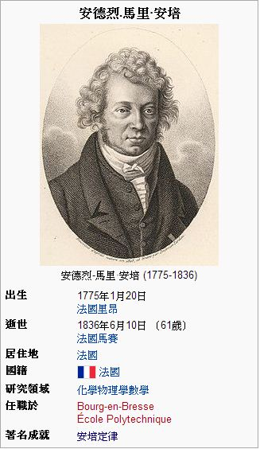
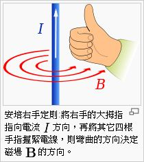
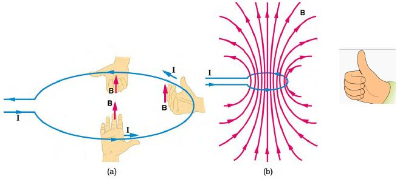
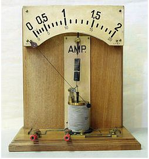
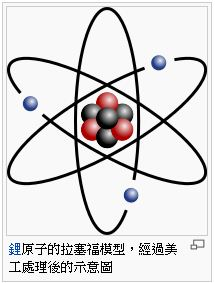
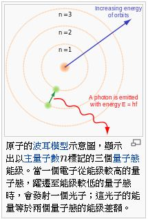

## 電磁學先鋒：安德烈-馬里·安培 (André-Marie Ampère)

安德烈-馬里·安培（André-Marie Ampère，FRS，1775年－1836年），法國化學家，在電磁作用方面的研究成就卓著，
對物理學及數學也有重要貢獻。電流的國際單位安培即以其姓氏命名。

1820年 7月，H.C.奧斯特發表關於電流磁效應的論文後，安培馬上集中精力研究，幾周內就提出了安培定則即右手螺旋定則。
隨後很快在幾個月之內連續發表了 3 篇論文，並設計了 9 個著名的實驗，總結了載流迴路中電流元在電磁場中的運動規律，
即安培定律。

1820年 9月25日，安培報告了兩根載流導線存在相互影響，相同方向的平行電流彼此相吸，相反方向的平行電流彼此相斥；
對兩個線圈之間的吸引和排斥也作了討論。通過一系列經典的和簡單的實驗，他認識到磁是由運動的電產生的。

1821～1825年，安培做了關於電流相互作用的四個精巧的實驗，並根據這四個實驗導出兩個電流源之間的相互作用力公式。

1827年，安培將他的電磁現象的研究綜合在《電動力學現象的數學理論》一書中 ，這是電磁學史上一部重要的經典論著，
對以後電磁學的發展起了深遠的影響。

### 安培的科學貢獻

1、直線電流的安培定則用右手握住導線，讓伸直的大拇指所指的方向跟電流的方向一致，那麼彎曲的四指所指的方向就是磁感線的環繞方向。

然後、安培用數學描述這個現象，於是提出了著名的「安培定律」。

|          | 積分形式                               |  微分形式                     | 「馬克士威-安培方程式」的微分形式                                            |
|----------|----------------------------------------|-------------------------------|------------------------------------------------------------------------------|
| 安培定律 | $\oint_:C B \cdot \vec:dl = \mu_0 I$  | $\nabla \times B = \mu_0 J$  | $\nabla \times B = \mu_0 J+ \mu_0\varepsilon_0\frac:\partial E:\partial t$ |

「安培定律的積分形式」所述說的是：「電流直線流動 I 會造成環形磁場 $\oint_:C B \cdot \vec:dl$ 」，而後人所改寫的「微分形式」所述說的是：
「磁通量 B 的旋度 $\nabla \times B$ 來自於（產生該磁場的）傳導電流密度 J」。

這個定律後來經過馬克斯威的修正之後，成了「馬克斯威電磁波方程式」裏重要的一個公式，如上表最右邊的公式所示，
該公式主要加入了「電流的變化 (或說電通量變化) 也會造成磁場的改變」這個修正。

2、環形電流的安培定則讓右手彎曲的四指和環形電流的方向一致，那麼伸直的大拇指所指的方向就是環形電流中心軸線上磁感線的方向。 

3. 安培還發現，電流在線圈中流動的時候表現出來的磁性和磁鐵相似，創製出第一個螺線管，在這個基礎上發明了探測和量度電流的電流計。

4. 提出分子電流假說，認為構成磁體的分子內部存在一種環形電流，這在當時物質結構的知識甚少的情況下無法證實。但後來的科學家了解到物質由
分子組成，而分子由原子組成，原子中有繞核運動的電子，安培的分子電流假說有了實在的內容，已成為認識物質磁性的重要依據。

> 補充 1：1911年，拉塞福提出電子環繞原子旋轉的模型，此時距離安培電子流假說已將近百年，

> 補充 2： 1913年，波耳提出了拉塞福模型的改良版，加入了軌域的觀念。距離原子核越遠，軌域的能量就越高。當電子從距離原子核更遠的軌域，躍遷到距離原子核更近的軌域時，會以光子的形式釋放出能量。相反的，從低能級軌域躍遷到高能級軌域則會吸收能量。

藉著這些量子化軌域，波耳正確地計算出氫原子光譜。但是，使用波耳模型，並不能夠解釋譜線的相對強度，也無法計算出更複雜原子的光譜。
這些難題，尚待後來量子力學的解釋。

### 安培的小故事

安培思考科學問題專心致志，據說有一次，安培正慢慢地向他任教的學校走去，邊走邊思索著一個電學問題。
經過塞納河的時候，他隨手揀起一塊鵝卵石裝進口袋。過一會兒，又從口袋裡掏出來扔到河裡。到學校後，
他走進教室，習慣地掏懷錶看時間，拿出來的卻是一塊鵝卵石。原來，懷錶已被扔進了塞納河。

還有一次，安培在街上散步，走著走著，想出了一個電學問題的算式，正為沒有地方運算而發愁。突然，
他見到面前有一塊「黑板」，就拿出隨身攜帶的粉筆，在上面運算起來。那「黑板」原來是一輛馬車的車廂背面。
馬車走動了，他也跟著走，邊走邊寫；馬車越來越快，他就跑了起來，一心一意要完成他的推導，
直到他實在追不上馬車了才停下腳步。安培這個失常的行動，使街上的人笑得前仰後合。

### 結語

從以上的小故事我們可以看到，安培能夠在電磁學上有卓越的貢獻，並非僥倖而已，當一個人全心投入某個領域時，
才有可能在該領域散發出無比耀眼的光芒啊！

### 參考文獻
* 維基百科：[安德烈-瑪麗·安培](http://zh.wikipedia.org/wiki/%E5%AE%89%E5%BE%B7%E7%83%88-%E7%8E%9B%E4%B8%BD%C2%B7%E5%AE%89%E5%9F%B9)
* 維基百科：[安培定律](http://zh.wikipedia.org/wiki/%E5%AE%89%E5%9F%B9%E5%AE%9A%E5%BE%8B)
* 維基百科：[安培计](http://zh.wikipedia.org/wiki/%E5%AE%89%E5%9F%B9%E8%AE%A1)
* 維基百科：[電感](http://zh.wikipedia.org/zh-tw/%E7%94%B5%E6%84%9F)
* 維基百科：[電子](http://zh.wikipedia.org/zh-tw/%E7%94%B5%E5%AD%90)
* 維基百科：[拉塞福模型](http://zh.wikipedia.org/wiki/%E6%8B%89%E5%A1%9E%E7%A6%8F%E6%A8%A1%E5%9E%8B)
* [電的旅程：探索人類駕馭電子的歷史過程](http://www.books.com.tw/products/0010498148), 作者：張大凱, 遠見天下出版社
* [電磁波 ：一本電機系學生的入門書](http://www.tenlong.com.tw/items/9866184897?item_id=462096), 高銘盛, 滄海出版社

【本文由陳鍾誠取材並修改自 維基百科 與 OpenStax College 的 College Physics 一書，採用創作共用的 《姓名標示、相同方式分享》 授權】

