## 關於電磁場的一些疑問？

在學習電磁學之前，一定要先有幾個數學慨念，才能瞭解馬克士威方程式的意義。

這幾個數學概念分別是：「向量、微分、積分」，因為、電磁學的基礎是：「向量微積分」。

如果、讀者對於這三個主題已經有慨念了，那麼、就應該具備閱讀本文的基本能力了。

在本文中、我們將從「磁場、電場」等物理概念開始介紹，並且提出一些常見的電磁學問題？
像是「電場長甚麼樣？磁場長甚麼樣？電磁交互作用的方式？」等等，然後再看看一些電磁場
範例的圖片，以及電磁裝置的案例，讓讀者累積足夠多對電磁場的感覺後，再來探究背後的原理。

然後在下一期當中，我們將導入數學裏「向量場」的概念，接著介紹「向量微積分」的基本觀念，
像是「通量、環量、散度、旋度」等等。

最後、我們將從「向量微積分」回到電磁學領域，說明「馬克士威方程式」的意義與用途，
讓讀者能夠初步的理解電磁波的概念。

### 力場的概念

學習電磁學，第一個遇到的困難，就是要先理解「場」的概念。

很多人物理學得還不錯，但是到了「電場、磁場」的時候就卡關了，有這種情況的人，通嘗是無法接受「力場」
概念的學習者。

因為在機械的世界裏，所有的力都是接觸後才會生效的，也就是要人去推，東西才會動，我們很難接受那種
不需要推就會動的「神秘力量」。

但是、如果你就是不相信這種力量的存在，因而學不會電磁學，那就真的太冤枉了，只要轉變一下念頭，相信
這件事情存在，就有機會進入電磁學的神秘領域。

事實上、在牛頓的機械論世界了，就已經有「力場」的概念了，那個力場就是「重力場」。

重力也是一種「不需要推就會動的神秘力量」，當你從 101 大樓往下跳的時候，你會發現並沒有人推你，你還
是往下掉了，但是這種經驗與平常從樓梯上跳下來的經驗太像，以致於我們都覺得理所當然，因而不覺得這裏
需要用到像「電磁場」一樣的概念，就可以理解了。

如果、您能夠接受重力場的概念，那麼就應該有機會瞭解「電場」了。

### 電場的概念與疑問

學過原子模型的人都知道，電子繞著原子核旋轉，而且有時候電子會脫離原子核，跑到別的地方去，特別是在導體裏面更是如此。

我們通常會將原子想像成地球或行星，繞著太陽旋轉。這樣的類比其實是好的，因為行星與太陽之間有「重力場」，所以才不會脫離之後就飛走。

同樣的、電子與質子之間，也有一種「不需要接觸就能拉住的神秘力量」，那就是「帶負電的電子」與「帶正電的質子」之間的電吸引力，
這種吸引力讓電子繞著原子核旋轉，但不同的是，電子繞得很快，而且在導體內很容易受到「場」的力量而到處移動。

所以、像庫倫就提出了庫倫定律，表達兩個帶電粒子之間的力量，如以下圖片與公式所示：

假如兩個電荷的電性相同，那麼就會產生排斥力，如果相反，就會產生吸引力。

庫倫定律是容易接受的，因為我們很多人都玩過磁鐵，可以接受「同性相吸、異性相斥」的概念，而且能夠真實的感覺到那種力量。

然後、我們可能也還可以接受，將那些場的力量給畫出來的示意圖，像是以下的圖形所示：

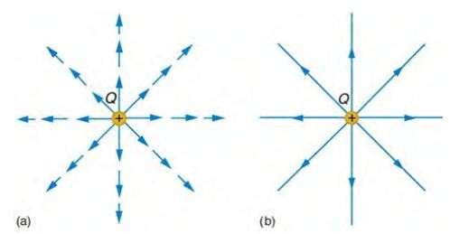

但是、相信您應該能看出上圖中的 (a) , (b) 兩者有不同，但是如果我們問一些問題，像是：

1. 這兩個圖都是場線嗎？
2. 那每一點的力量個是多少呢？
3. 那邊的力場比較大，哪邊的比較小呢？

這時恐怕很多人都說不出來了！

但是如果我們讓大家看以下的場線，可能就有人覺得可以說出一些道理：

為什麼我們說上圖中的 (c) 是比 (b) 更大的負電荷呢？視覺上的原因是 (c) 的場線畫得比較密。

但問題是、既然空間中到處都充滿了電場，為甚麼我們只畫了幾條線呢？這些線的長短代表甚麼意義呢？

然後、更難接受的是，像以下這種彎彎曲曲的電場線，到底代表的力量是多大呢？

然後、我們會看到像下列的金屬球，其表面的場線竟然自動轉彎，呈垂直角度射入或離開表面，這到底是甚麼意思呢？

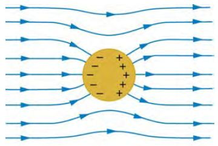

而且、上圖與下圖 (a) 中的金屬球內部都沒有畫任何線，這是代表內部沒有電場嗎？

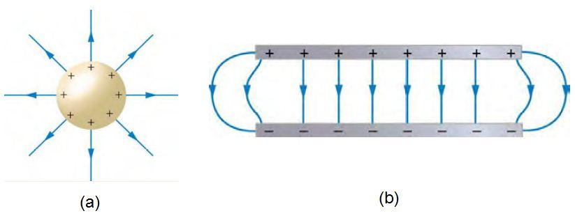

為何上圖中 (b) 的平行板場線在內部是直線，到了邊緣卻成了彎曲狀的呢？

場線怎麼這麼厲害，碰到金屬就會自動像下圖一樣立正站好，難到「金屬是電場線的長官嗎？」。

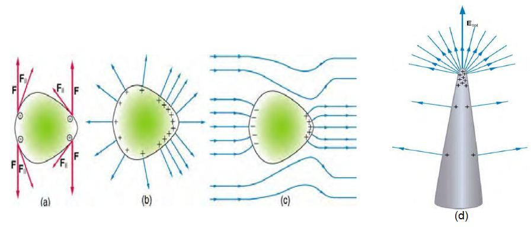

而且、好像在彎曲度越大的地方，帶電粒子就越多，這些電子是有智慧嗎？會自動感知表面的彎曲度，然後擠到那邊去嗎？
這不是人才會做的事嗎？

然後像下列這樣有場線又有伏特數標示的等高線圖又是甚麼意思呢？

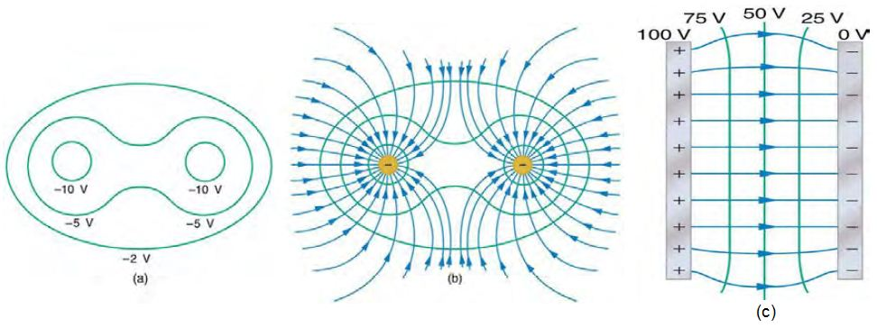

從下圖看來，電容當中的填充物好像會影響場線，那應該填些甚麼東西？才能讓電容量盡可能變大呢？

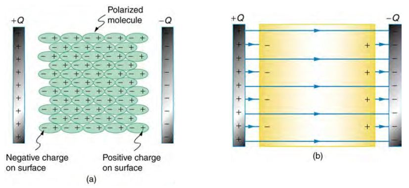

### 磁場的概念與疑問

問題：磁力也會形成力場嗎？那磁力線應該怎麼畫呢？

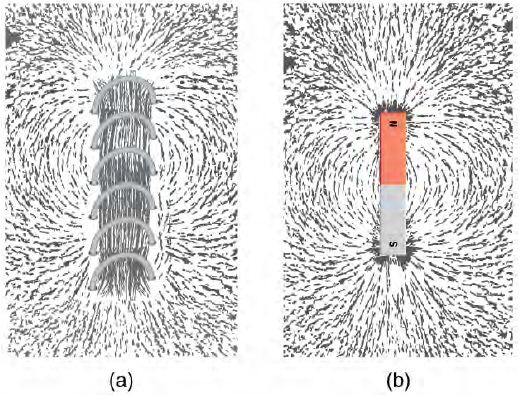

問題：磁場與電場有關嗎？兩種力會互相影響嗎？是互相抵消、互相促進，還是怎麼樣呢？

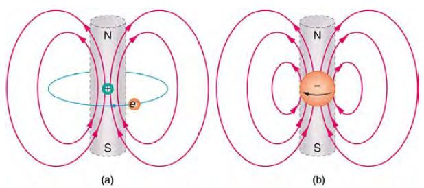

問題：磁場與電場同時存在的場線該怎麼畫呢？

問題：一般的鐵塊在線圈裏為何會變成電磁鐵呢？硬碟、磁帶、電磁爐等裝置的電磁原理是甚麼呢？

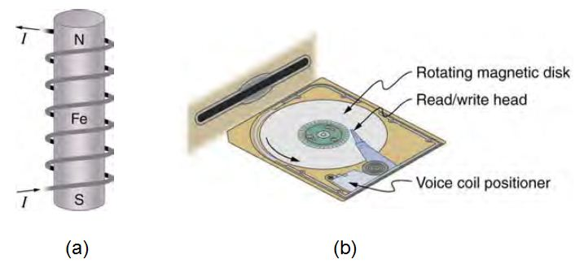

問題：我們要怎樣才能看到磁力線呢？指南針會受磁力線影響嗎？

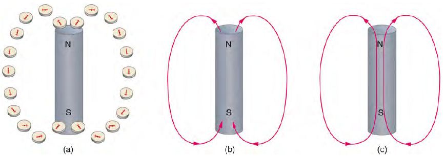

問題：電力和磁力會互相影響嗎？關係式是甚麼呢？

問題：垂直磁場中的電子會如何移動呢？平飛還是轉圈圈呢？

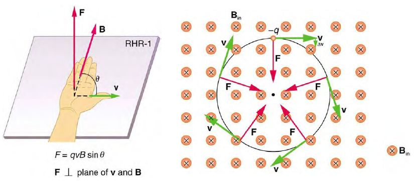

問題：大一物理裏面的「感應電動勢」(EMF) 到底是一種電場還是磁場呢？

### 關於電磁交互作用的疑問？

問題：馬達為甚麼會轉？發電機如何發電？

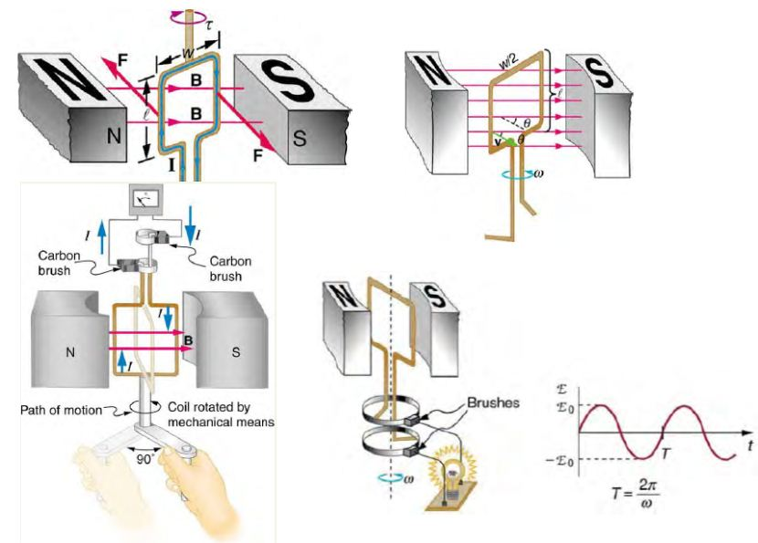

問題：馬達為何會產生逆向電動勢 (Back Emf)，其原理為何？

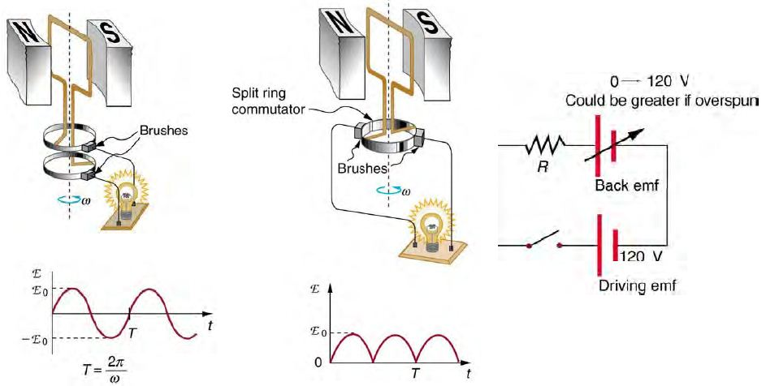

Back Emf 的原理請參考下列影片：

* Back Emf 動畫原理 (讚！)： Commutators: Basics on AC and DC Generation 
	* <http://www.youtube.com/watch?v=ATFqX2Cl3-w>
* Back Emf 原理說明： (Back Emf of a DC Motor) 
	* <http://www.youtube.com/watch?v=qwtiX3pFCIE>
* Back Emf 量測實驗： ("Back EMF" Theory and Practice Paul Wesley Lewis) 
	* <http://www.youtube.com/watch?v=VwDot8TMIqA>

問題：變壓器的原理是甚麼，那些線圈的數量與電磁效應有何關係？

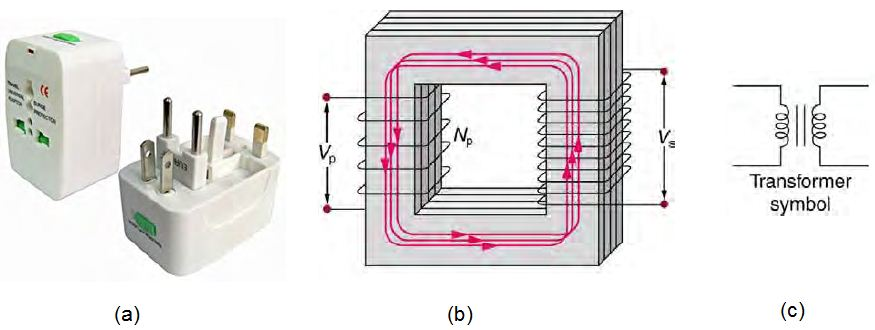

問題：電感是甚麼？我們有可能做出無線隔空充電的裝置嗎？

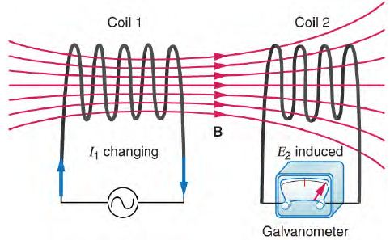

問題：電磁波如何產生，如何傳遞，有方向性嗎？

問題：第一個用證明電磁波可傳遞的赫茲 (Hertz) ，他的實驗是怎麼做的呢？

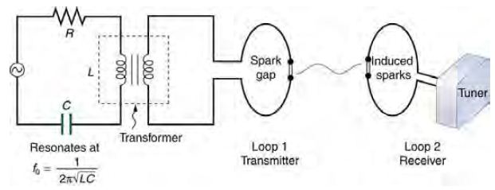

問題：電磁波是如何傳遞的？有沒有方向性的呢？該如何才能接收的更清楚呢？

問題：電波和磁波的震盪方向一樣嗎？

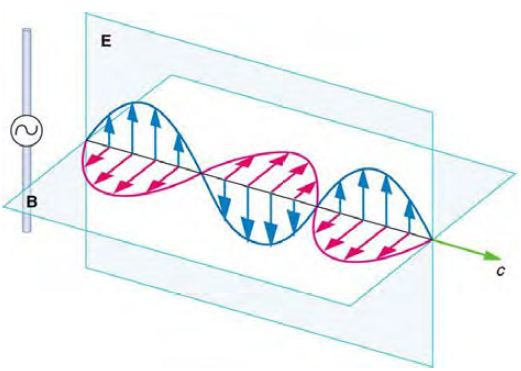

問題：「收音機、微波爐、X 射線」等電磁波，其震盪頻率與波長各約多少呢？

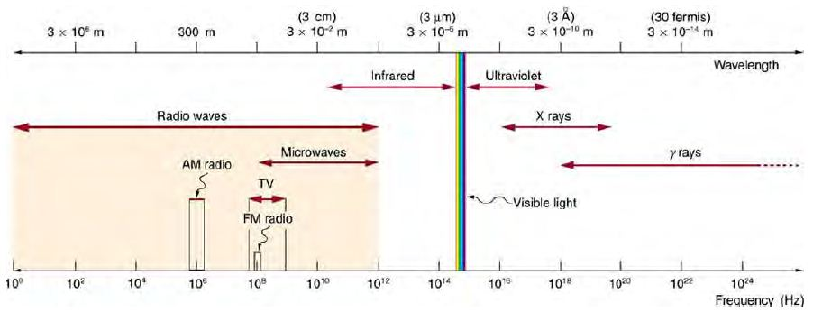

問題：收音機廣播的聲音，是如何放到電磁波裏傳播的呢？FM 調頻與 AM 調幅有甚麼差異呢？

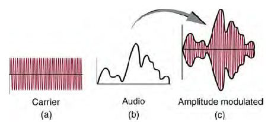

問題：電視天線為何長那樣？那接收國外節目的小耳朵為何長得不一樣呢？

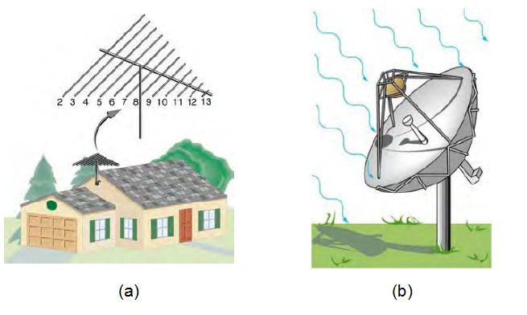

### 小結

現在、讀者應該心裏已經充滿了一堆問號了吧！

不過、如果您仔細看那些圖片，應該就可對照大一物理課本想起來那些問題的解答。

如果想不起來，推薦給大家一本很棒的物理課本，而且是免費的，那就是由 RICE University 所成立的 OpenStax College 網站，
提供的一本 [College Physics] 物理學電子書，這本書是我所找到網路上最棒的物理學電子書了。

如果您看看上述的電子書，特別是有關電磁學的那部份，相信會感受到 OpenStax 在編輯上是很用心的。

疑問是求知背後最大的驅動力，有了這些物理學的基礎，我們就可以在下期解釋這些現象背後的數學原理：「向量微積分」與「馬克斯威方程式」了。

### 參考文獻
* [College Physics], OpenStax College.
* 維基百科：[庫侖定律](http://zh.wikipedia.org/wiki/%E5%BA%93%E4%BB%91%E5%AE%9A%E5%BE%8B)

【本文由陳鍾誠取材並修改自 [維基百科] 與 OpenStax College 的 [College Physics] 一書，採用創作共用的 [姓名標示、相同方式分享] 授權】

